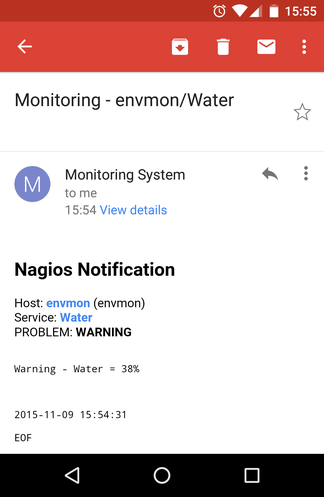

# go_mail
E-mail sender

## Information

Features:
- HTML support
- SMTP server authentication
- SMTP encryption
- Works with Gmail

## e-mail sample



## Usage
``` sh
./go_mail <subject> <from@example.com> <From Name> <destination@example.com>
```

## Example
``` sh
./go_mail test from@example.com "Sender User Name" destination@example.com
```

## Scripting
Try to run `run` script demo:
``` sh
#!/bin/bash
echo -e "<html>
<body>
<h1>go_mail</h1>
<p>Tese 1</p>
<p>Test 2</p>
<p>Test 3</p>
</body>
<html>
\nEOF
" | \
./go_mail "$(date +'%Y-%m-%d %H:%M:%S')" marcio.pessoa@gmail.com \
  "Nagios System" marcio.pessoa@gmail.com
```
